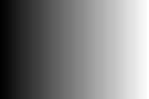
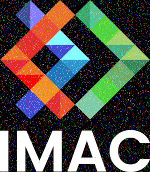
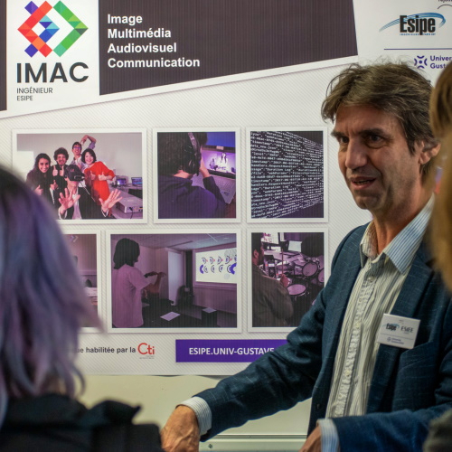
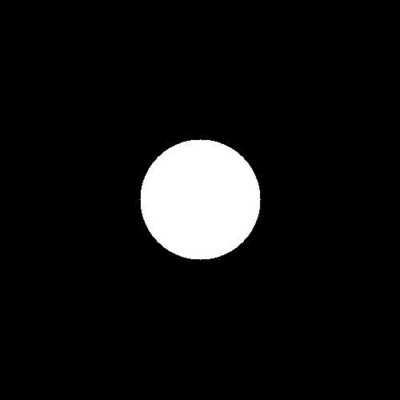
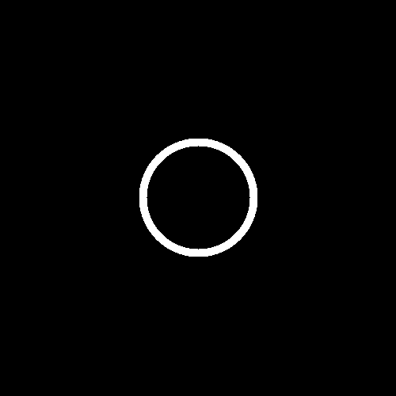
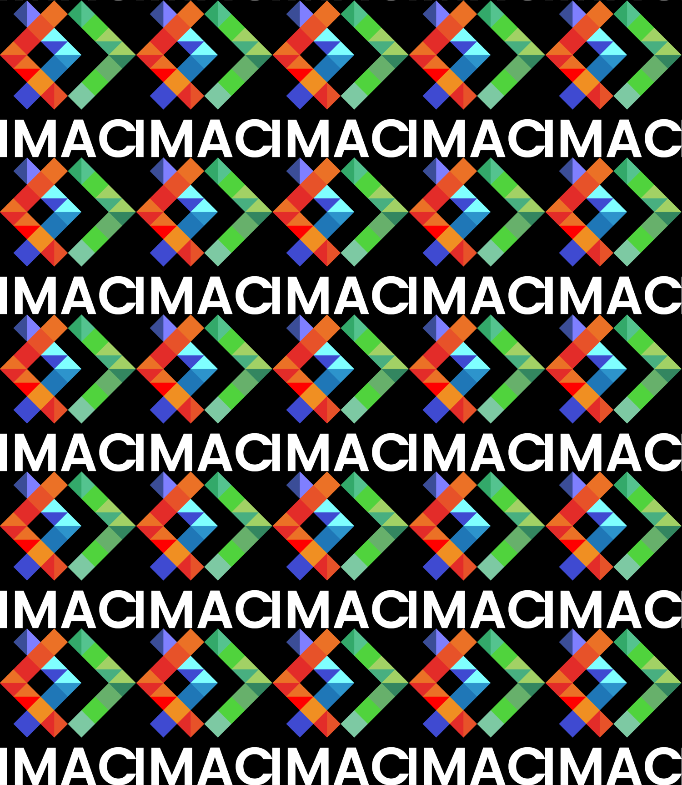
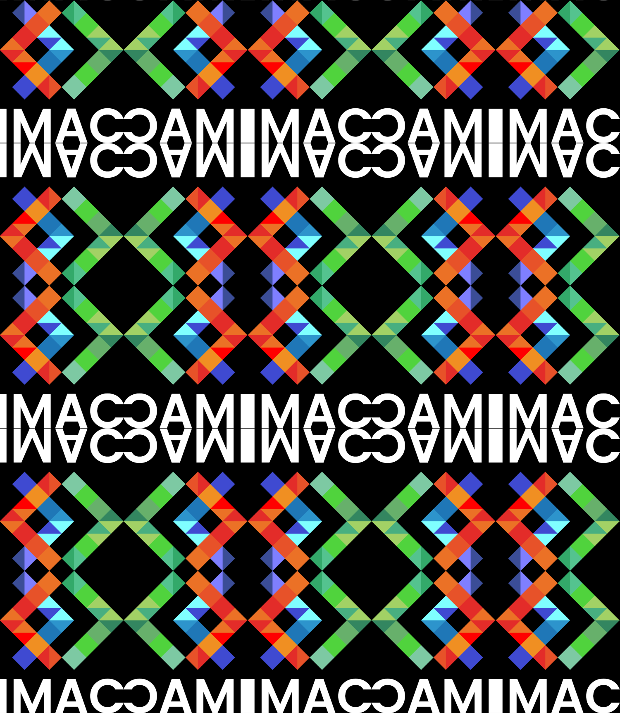

# 🐣 S1 | Prog: Workshop

Template de projet pour le workshop de prog des Imac1. Vous trouverez le sujet ici: https://dsmte.github.io/Learn--cpp_programming/Workshop#

## ⭐ Ne garder que le vert

| Avant                  |               Après               |
| ---------------------- | :-------------------------------: |
|  |  |

## ⭐ Échanger les canaux

| Avant                  |              Après              |
| ---------------------- | :-----------------------------: |
|  |  |

## ⭐ Noir & Blanc

| Avant                  |               Après               |
| ---------------------- | :-------------------------------: |
|  |  |

## ⭐ Négatif

| Avant                  |          Après           |
| ---------------------- | :----------------------: |
|  |  |

## ⭐ Dégradé

|              Rendu               |
| :------------------------------: |
|  |

## ⭐⭐ Miroir

| Avant                  |          Après           |
| ---------------------- | :----------------------: |
|  |  |

## ⭐⭐ Image bruitée

| Avant                  |          Après          |
| ---------------------- | :---------------------: |
|  |  |

## ⭐⭐ Rotation de 90°

| Avant                  |           Après            |
| ---------------------- | :------------------------: |
|  |  |

## ⭐⭐ RGB split

| Avant                  |            Après            |
| ---------------------- | :-------------------------: |
|  |  |

## ⭐⭐ Luminosité

| Avant                   |   Après éclaircissement   |
| ----------------------- | :-----------------------: |
|  |  |

| Avant                   |  Après assombrissement   |
| ----------------------- | :----------------------: |
|  |  |

## ⭐⭐(⭐) Disque

| Rendu                    |
| ------------------------ |
|  |

- ### ⭐ Cercle
  | Rendu                         |
  | ----------------------------- |
  |  |
- ### ⭐⭐ Animation
  | Rendu              |
  | ------------------ |
  |  |
- ### ⭐⭐⭐ Rosace
  | Rendu                    |
  | ------------------------ |
  |  |

## ⭐⭐ Mosaïque

| Avant                  |                          Après                           |
| ---------------------- | :------------------------------------------------------: |
|  |  |

## ⭐⭐⭐⭐ Mosaïque miroir

| Avant                  |              Après              |
| ---------------------- | :-----------------------------: |
|  |  |

## ⭐⭐⭐ Glitch

## ⭐⭐⭐ Tri de pixels

## ⭐⭐⭐ Dégradé dans l'espace de couleur Lab

## Quelques effets
