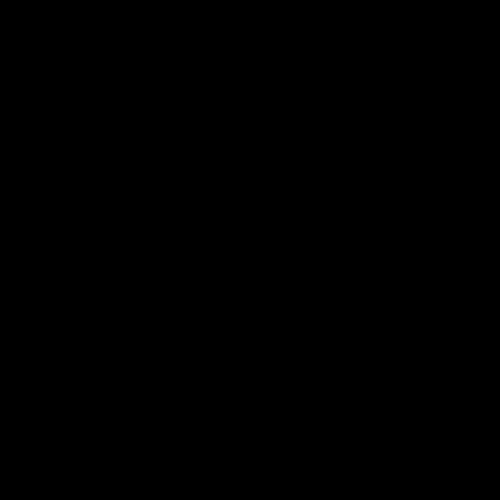
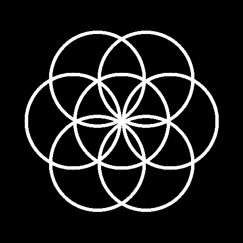
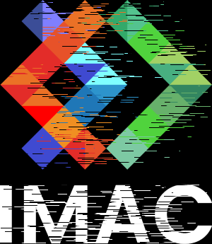
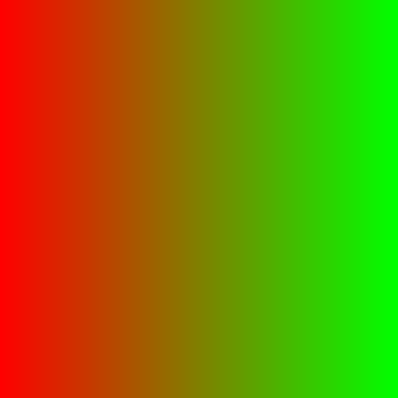

<!-- @import "[TOC]" {cmd="toc" depthFrom=1 depthTo=6 orderedList=false} -->

# Lilian Peuron - S1 | Prog: Workshop

<!-- code_chunk_output -->

- [Lilian Peuron - S1 | Prog: Workshop](#lilian-peuron---s1--prog-workshop)
  - [⭐ Ne garder que le vert](#-ne-garder-que-le-vert)
  - [⭐ Échanger les canaux](#-échanger-les-canaux)
  - [⭐ Noir & Blanc](#-noir--blanc)
  - [⭐ Négatif](#-négatif)
  - [⭐ Dégradé](#-dégradé)
  - [⭐⭐ Miroir](#-miroir)
  - [⭐⭐ Image bruitée](#-image-bruitée)
  - [⭐⭐ Rotation de 90°](#-rotation-de-90)
  - [⭐⭐ RGB split](#-rgb-split)
  - [⭐⭐ Luminosité](#-luminosité)
  - [⭐⭐(⭐) Disque](#-disque)
  - [⭐⭐ Mosaïque](#-mosaïque)
  - [⭐⭐⭐⭐ Mosaïque miroir](#-mosaïque-miroir)
  - [⭐⭐⭐ Glitch](#-glitch)
  - [⭐⭐⭐ Tri de pixels](#-tri-de-pixels)
  - [⭐⭐⭐ Dégradé dans l'espace de couleur Lab (pas fini)](#-dégradé-dans-lespace-de-couleur-lab-pas-fini)
  - [⭐⭐⭐(⭐) Fractale de Mandelbrot](#-fractale-de-mandelbrot)
  - [⭐⭐⭐(⭐) Tramage](#-tramage)
  - [Quelques effets & bugs](#quelques-effets--bugs)

<!-- /code_chunk_output -->

## ⭐ Ne garder que le vert

| Avant                                                  |                               Après                               |
| ------------------------------------------------------ | :---------------------------------------------------------------: |
|  |  |

## ⭐ Échanger les canaux

| Avant                                                  |                              Après                              |
| ------------------------------------------------------ | :-------------------------------------------------------------: |
|  |  |

## ⭐ Noir & Blanc

| Avant                                                  |                               Après                               |
| ------------------------------------------------------ | :---------------------------------------------------------------: |
|  |  |

## ⭐ Négatif

| Avant                                                  |                          Après                           |
| ------------------------------------------------------ | :------------------------------------------------------: |
|  |  |

## ⭐ Dégradé

| Avant                                                        |                              Après                               |
| ------------------------------------------------------------ | :--------------------------------------------------------------: |
|  |  |

## ⭐⭐ Miroir

| Avant                                                  |                          Après                           |
| ------------------------------------------------------ | :------------------------------------------------------: |
|  |  |

## ⭐⭐ Image bruitée

| Avant                                                  |                          Après                          |
| ------------------------------------------------------ | :-----------------------------------------------------: |
|  |  |

## ⭐⭐ Rotation de 90°

| Avant                                                  |           Après            |
| ------------------------------------------------------ | :------------------------: |
|  |  |

## ⭐⭐ RGB split

| Avant                                                  |                            Après                            |
| ------------------------------------------------------ | :---------------------------------------------------------: |
|  |  |

## ⭐⭐ Luminosité

| Avant                   |   Après éclaircissement   |
| ----------------------- | :-----------------------: |
|  |  |

| Avant                   |  Après assombrissement   |
| ----------------------- | :----------------------: |
|  |  |

## ⭐⭐(⭐) Disque

|                            Avant                             |                          Après                           |
| :----------------------------------------------------------: | :------------------------------------------------------: |
|  |  |

- ### ⭐ Cercle
  |                            Avant                             |                             Après                             |
  | :----------------------------------------------------------: | :-----------------------------------------------------------: |
  |  |  |
- ### ⭐⭐ Animation
  |                            Avant                             |                            Après                             |
  | :----------------------------------------------------------: | :----------------------------------------------------------: |
  |  |  |
- ### ⭐⭐⭐ Rosace
  |                            Avant                             |                          Après                           |
  | :----------------------------------------------------------: | :------------------------------------------------------: |
  |  |  |

## ⭐⭐ Mosaïque

|                         Avant                          |                          Après                           |
| :----------------------------------------------------: | :------------------------------------------------------: |
|  |  |

Pour la mosaïque, j'ai multiplié la taille de l'image par cinq par rapport à l'image d'origine.

À chaque fois que mon compteur x équivaut à la width ou que mon compteur y équivaut à la height de l'image d'origine, le compteur en question se réinitialise à zéro.

```cpp
void mosaic(sil::Image& image)
{
    sil::Image img_mosaic{(image.width() * 5),(image.height() * 5)};
    int counterX {};
    int counterY {};

        for (int x{0}; x < img_mosaic.width(); x++)
        {
            counterX++;

            if (counterX == image.width())
            {
                counterX = 0 ;
            }

            for (int y{0}; y < img_mosaic.height(); y++)
            {
                counterY++;

                if (counterY == image.height())
                {
                    counterY = 0;
                }

                img_mosaic.pixel(x,y) = image.pixel(counterX,counterY);

            }
        }

    img_mosaic.save("output/mosaic.png");
}

```

## ⭐⭐⭐⭐ Mosaïque miroir

|                         Avant                          |                              Après                              |
| :----------------------------------------------------: | :-------------------------------------------------------------: |
|  |  |

Pour la mosaïque miroir, j'ai ajouté deux compteurs pour savoir si je devais inverser l'image horizontalement et/ou verticalement.

```cpp
  void mirror_mosaic(sil::Image& image)
{
    sil::Image img_mosaic{(image.width() * 5),(image.height() * 5)};
    int counterX {};
    int counterY {};
    int isMirrorX {};
    int isMirrorY {};


        for (int x{0}; x < img_mosaic.width(); x++)
        {
            counterX++;

            if (counterX == image.width())
            {
                counterX = 0 ;
                isMirrorX ++;
            }


            for (int y{0}; y < img_mosaic.height(); y++)
            {
                counterY++;

                if (counterY == image.height())
                {
                    counterY = 0;
                    isMirrorY ++;

                    if (isMirrorY > 4)
                    {
                        isMirrorY = 0;
                    }

                }

                if (isMirrorX % 2 != 0)
                {
                    if (isMirrorY % 2 != 0)
                    {
                        img_mosaic.pixel(x,y) = image.pixel((image.width() - 1 - counterX),(image.height() - 1 - counterY));
                    }
                    else
                    {
                        img_mosaic.pixel(x,y) = image.pixel((image.width() - 1 - counterX),counterY);
                    }
                }
                else
                {
                    if (isMirrorY % 2 != 0)
                    {
                        img_mosaic.pixel(x,y) = image.pixel(counterX, (image.height() - 1 - counterY));
                    }
                    else
                    {
                        img_mosaic.pixel(x,y) = image.pixel(counterX,counterY);
                    }
                }
            }
        }

            img_mosaic.save("output/mirror_mosaic.png");
}
```

## ⭐⭐⭐ Glitch

| Avant                                                  |                          Après                           |
| ------------------------------------------------------ | :------------------------------------------------------: |
|  |  |

## ⭐⭐⭐ Tri de pixels

| Avant                                                  |                              Après                              |
| ------------------------------------------------------ | :-------------------------------------------------------------: |
|  |  |

## ⭐⭐⭐ Dégradé dans l'espace de couleur Lab (pas fini)

|                            Avant                             |                             Après                              |
| :----------------------------------------------------------: | :------------------------------------------------------------: |
|  |  |

J'ai créé le gradient mais je n'ai pas réussi à le convertir en espace de couleur Lab.

## ⭐⭐⭐(⭐) Fractale de Mandelbrot

|                            Avant                             |                            Après                             |
| :----------------------------------------------------------: | :----------------------------------------------------------: |
|  |  |

## ⭐⭐⭐(⭐) Tramage

|          Avant          |           Après           |
| :---------------------: | :-----------------------: |
|  |  |

## Quelques effets & bugs

|         Avant          |                            Après                             |
| :--------------------: | :----------------------------------------------------------: |
|  |  |

Lors de la réalisation de ma mosaïque mirroir. La mosaïque a créé des trames horizontales. Quand on zoom et dézoom, à cause du problème d'affichage. Le visuel change quand on zoom ou dézoom la photo sur VScode, le lecteur d'image à des problèmes d'affichage."

```cpp
void new_effect(sil::Image& image)
{
    sil::Image img_mosaic{(image.width() * 5),(image.height() * 5)};
    int counterX {};
    int counterY {};

    int mirrorX  {image.width() - 1 - counterX};

        for (int x{0}; x < img_mosaic.width(); x++)
        {
            counterX++;

            if (counterX == image.width())
            {
                counterX = 0 ;
            }

            for (int y{0}; y < img_mosaic.height(); y++)
            {
                counterY++;

                if (counterY == image.height())
                {
                    counterY = 0;
                }

                if (counterY % 2 == 0)
                {
                    img_mosaic.pixel(x,y) = image.pixel(counterX,counterY);
                }
                else
                {
                    img_mosaic.pixel(x,y) = image.pixel(mirrorX,counterY);

                }

            }
        }

    img_mosaic.save("output/new_effect.png");
}
```

| Avant                  |                Après                |
| ---------------------- | :---------------------------------: |
|  |  |
